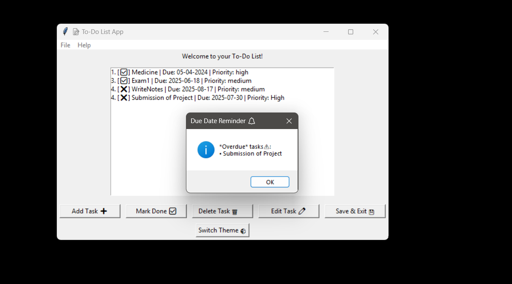

# 📝 To-Do List App (Python + Tkinter)

A **desktop To-Do List application** built with **Python** and **Tkinter**, designed to help users manage daily tasks efficiently.  
It comes with an intuitive interface, light/dark mode support, and reminder notifications for better productivity.

---

## 🚀 Features

- **🔐 User Login**  
  - Simple login system (default credentials: `shreeja` / `welcome123`)

- **🗂️ Task Management**  
  - Add, edit, delete tasks  
  - Mark tasks as completed  
  - Data persistence with JSON file storage  

- **⏰ Due Date Reminders**  
  - Alerts for tasks due today or overdue  

- **🌗 Light & Dark Mode**  
  - Toggle between light and dark themes for better accessibility  

---

## 📸 Screenshots  

| Login Page | Main App (Light Mode) | Dark Mode | Reminder Popup |
|------------|------------------------|-----------|----------------|
|  |  |  |  |

---

## 🛠️ Tech Stack

- **Language**: Python 3.x  
- **GUI**: Tkinter  
- **Storage**: JSON  
- **Utilities**: datetime (reminders)  

---

## ⚡ Getting Started

### ✅ Prerequisites
- Python **3.10+** installed

### 📜 License
- This project is licensed under the MIT License.

### 📥 Installation
```bash
# Clone the repository
git clone https://github.com/yourusername/todo-list-gui.git

# Navigate into the project folder
cd todo-list-gui

# Run the application
python todo_gui.py
