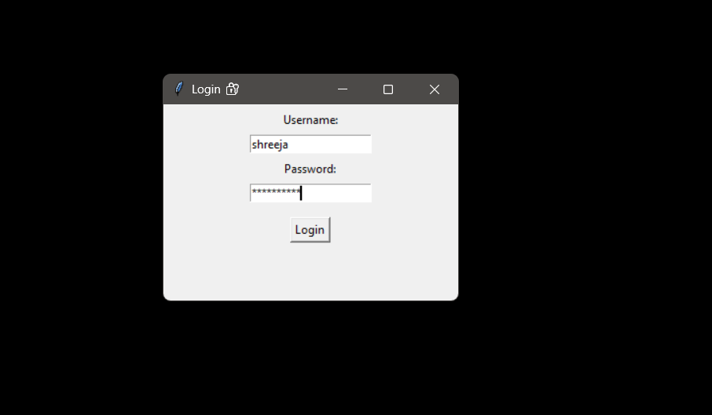
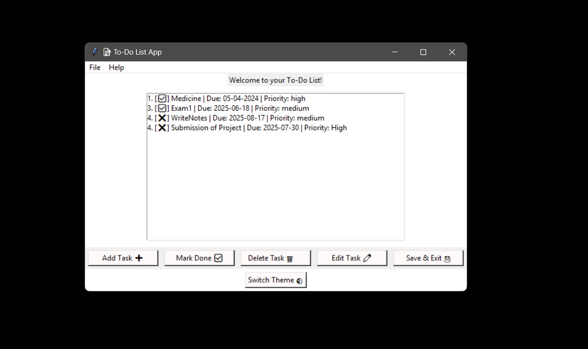
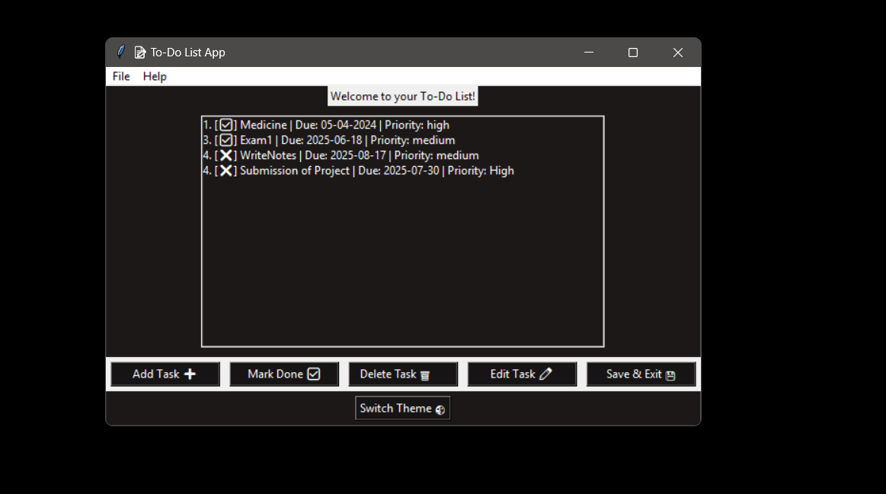

# To-Do List App (Python + Tkinter)

A simple yet powerful desktop To-Do List application built using **Python** and **Tkinter**, featuring:

1) Login system  
2) Light/Dark Mode toggle  
3) Due date reminders  
4) Add, Edit, Delete, and Complete tasks  
5) JSON file storage for persistence  

---

## Screenshots

| Login Page | Main App (Light Mode) | Dark Mode | Remainder popup|
|------------|------------------------|-----------|---------------|
|  |  |  | |

---

## Features

- **User Login**
  - Simple hardcoded login screen (username: `shreeja`, password: `welcome123`)
  
- **Task Management**
  - Add, edit, delete tasks
  - Mark tasks as completed
  - JSON-based task saving
  
- **Due Date Reminders**
  - Reminds about tasks due today or overdue at startup

- **Dark Mode**
  - Toggle between light and dark themes

---

## Technologies Used 💻 

- Python 3.x
- Tkinter (GUI)
- JSON (File storage)
- datetime (for due date reminders)

---

##  Getting Started

### Requirements

- Python 3.10+ installed

###  Installation

```bash

git clone https://github.com/yourusername/todo-list-gui.git
cd todo-list-gui
python todo_gui.py
